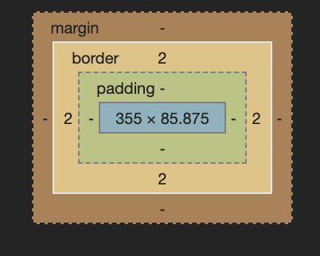

# Découverte du css
Le CSS permet d'appliquer un style à une balise html. Vous trouverez dans le répertoire _/public_ le fichier _pendu.css_ qui contient le code suivant :

    body{
      background-color: #7a4c81;
    }

    #entete{
      border:2px solid #302535;
    }

    .aTrouver{
      font-size: 2.5em;
    }

Le CSS s'écrit toujours de la même façon : un sélécteur suivit des règles de style. Les sélecteurs sont de 3 types, comme dans notre exemple :
* __body__ : en appelant directement la balise sur laquelle il faut appliquer le style.
* __#entete__ : en appelant l'__id__ de la balise sur laquelle il faut appliquer le style.
* __.aTrouver__ : en appelant la __class__ des balises sur les qulles il faut appliquer le style.

Les règles de styles sont entre accolades et se terminent toutes par un point-virgule. Elle permettent de modifier :
* La forme de la balise (coins arrondis, largeur, hauteur..)
* La position de la balise (en haut, au centre, alignée..)
* La mise en forme de la balise (couleur, bordure, police..)

Il existe un très grand nombre de règles qui peuvent être retrouvées sur [MDN](https://developer.mozilla.org/fr/docs/Web/CSS/Reference).

## Appliquer une feuille de style à une page web
Pour appliquer une feuille de style à une page web, il suffit d'ajouter cette ligne de code dans l'entête HTML :

    <link rel="stylesheet" href="./public/pendu.css">
  
Faites le pour les deux fichiers html du projet et observez ce que cela donne.

## Police
Pour changer la police d'une page web, il faut :
* tout d'abord charger la police voulu, en ajoutant, dans l'entête, une balise de ce type :

      <link href="https://fonts.googleapis.com/css?family=Open+Sans&display=swap" rel="stylesheet">

* faire appelle à la police dans le style, en ajoutant, la règle suivante, pour le __BODY__ par exemple :

        font-family: "Open Sans",Arial,sans-serif;

Dans cette exemple, la police _Open Sans_ est chargée à partir du site [Google Fonts](https://fonts.google.com) et appliquée au __BODY__ grâce à la règle __font-family__. Par héritage, _Open Sans_ devient la police de toutes les balises de la page. Si jamais, cette font ne peut être chargée, il faut alors appliqué _Arial_, et ainsi de suite avec toutes les polices déclarées dans __font-family__.

Il est possible de faire beaucoup d'autres choses avec la police, comme changer la taille de la font ou la couleur :

    font-size: 1,5em;
    color:#302535;

* la taille de la police est exprimée en __em__, une taille relative à l'écran qui rend le texte responsive.
* La couleur est définie par une valeur hexadécimale, valeur donnée par la plupart des outils de traitement d'images.

## Background
Le __background-color__ permet donc de définir une couleur de fond pour la balise. En l'appliquant sur le __BODY__ on obtient une couleur de fond pour tout le site. Il peut être appliqué à n'importe quelle balise. Ajoutez le background suivant au sélecteur __#entete__ :

    background-color: white;
 
 Il est aussi possible d'ajouter une image de fond, avec __background-image__ :
 
    background-image: url(https://st3.depositphotos.com/3244131/12949/v/950/depositphotos_129491694-stock-illustration-school-notebook-paper-sheet-exercise.jpg);
 
 Mais il est rare d'utiliser cette règle seule, comme l'illustre [MDN](https://developer.mozilla.org/fr/docs/Web/CSS/background-size).

## Bordures
La feuille de style ajoute une bordure à la __DIV__ _entete_, grâce à la règle suivante :
    
    border:2px solid #302535;
    
* __2px__ : épaisseur de la bordure.
* __solid__ : style de la bordure.
* __#302535__ : couleur de la bordure.

Il est possible d'arrondir les coins des cadres grâce à la rèlge suivante :

    border-radius: 10px;
    
Appliquez le même style à toutes les __DIV__ sauf _page_.

## Positionnement

CSS propose de nombreuses façons de placer les éléments sur une page. 

### Marges
Tous d'abord, sachez que chaque balise dispose d'un padding et d'une margin :

Il est possible de les définir aves les règles __padding__ et __margin__. 

En exemple, ajoutez la règle suivante dans un sélecteur __H1__ :

    padding: 2em;

Puis cette règle pour les __DIV__ :

    margin: 2em;
    
Remarquez que les marges sont définis en em pour rester responsive et correspondre à la taille de police utilisée.

Pour notre projet, nous avons besoin d'ajouter les règles suivantes :

    #page{
        width:80%;
        margin:auto;
    }

* __width__ définit une largeur à 80% de l'écran. le pourcentage rend la taille responsive.
* __margin__ en auto permet de centrer la balise, le navigateur calculant automatiquement les margins left et right.

### Positionnement spécifique
Il existe des règles pour positionner du contenu plus précisement, comme par exemple :

    text-align: center;
    
Cette règle va placer le contenu au centre de la balise. Vous pouvez l'appliquer à toutes les __DIV__.

### Flex Box
C'est une méthodes pour positionner les balises les unes par rapport aux autres. Il faut, pour ça, définir une balise conteneur, comme la __DIV__ _page_ par exemple :

    #page{
        width:80%;
        margin:auto;
        display:flex;
    }
    
Par défaut, les balises sont alors alignées. Pour les remettre en colonne, ajoutons :

    flex-direction: column;
    
Maintenant que les bases du CSS sont vus, terminons la feuille de style à l'étape 4.
