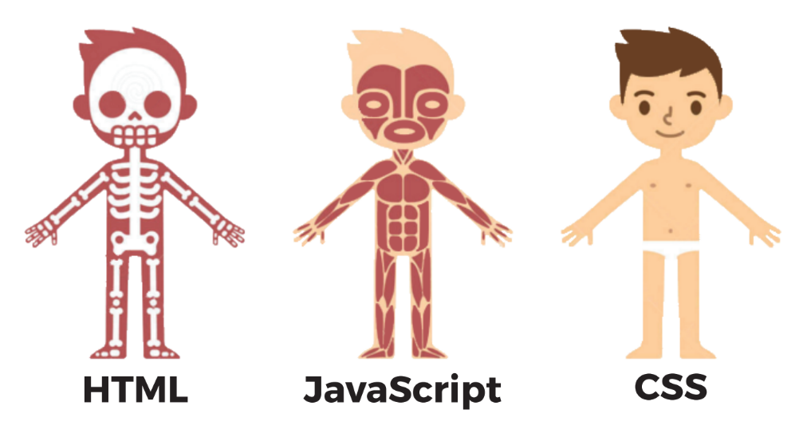

# TP Jeu du Pendu par le Garage
TP pour la journée d'initiation le Garage

Ce TP a pour but de vous initier au développement web avec du code HTML/CSS/JS.

C'est du code client, c'est à dire des langages interprétés par votre navigateur pour afficher une page web.

Pourquoi faire la différence entre front et back end ?
Cela vient de l'architecture client/serveur, sur laquelle repose le web

Il y a donc des langages côté client et côté serveur.

## Déroulement du TP
Chaque langage a son utilité pour le TP :

Chaque branche représente une étape pour la création du jeu du pendu :
* [Découverte du HTML](https://github.com/JaminNormand/pendu-le-garage/blob/step-1/README.md)
* Première page HTML
